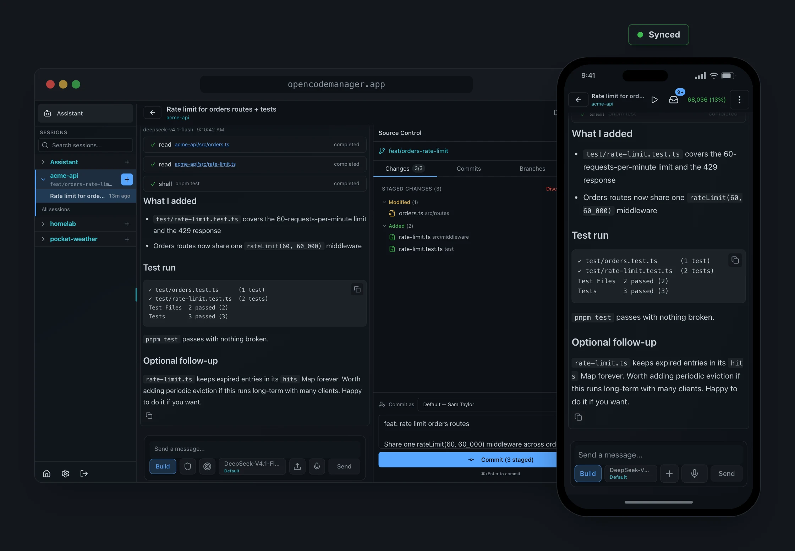

<h1 align="center">OpenCode Manager</h1>

<p align="center">
    <strong>A self-hosted command center for <a href="https://opencode.ai">OpenCode</a>. Sessions, git, terminal, and schedules in one web app, on your desktop and your phone.</strong>
</p>

<p align="center">
    <a href="https://opencodemanager.app"><strong>opencodemanager.app</strong></a>
    ·
    <a href="https://opencodemanager.app/docs">Docs</a>
    ·
    <a href="https://github.com/chriswritescode-dev/opencode-manager/releases/latest">Releases</a>
</p>

<p align="center">
    <a href="https://github.com/chriswritescode-dev/opencode-manager/blob/main/LICENSE">
        
    </a>
    <a href="https://github.com/chriswritescode-dev/opencode-manager/stargazers">
        
    </a>
    <a href="https://github.com/chriswritescode-dev/opencode-manager/releases/latest">
        
    </a>
    <a href="https://github.com/chriswritescode-dev/opencode-manager/pulls">
        
    </a>
</p>

<p align="center">
    <a href="https://opencodemanager.app">
        
    </a>
</p>

## Quick Start

Requires Docker with Compose v2.

```bash
curl -fsSL https://opencodemanager.app/install | sh
```

The installer starts OpenCode Manager on http://localhost:5003 and asks before sharing anything from your machine. Re-run it to update. On first launch you create an admin account.

Requirements, Compose and source installs, and every feature are covered at **[opencodemanager.app](https://opencodemanager.app)**:

- [Installation](https://opencodemanager.app/docs/getting-started/installation)
- [Features](https://opencodemanager.app/docs/features/overview)
- [Configuration](https://opencodemanager.app/docs/configuration/environment)
- [`ocm` CLI](https://opencodemanager.app/docs/ocm-cli)
- [Troubleshooting](https://opencodemanager.app/docs/troubleshooting)

## Development

This repository is a pnpm workspace: `backend/` (Bun + Hono), `frontend/` (React + Vite), `shared/` (schemas and types) and `ocm-cli/` (the `ocm` CLI).

```bash
pnpm install
pnpm dev
pnpm lint
pnpm typecheck
pnpm test
```

See the [Development Guide](https://opencodemanager.app/docs/development/setup) for setup, scripts, database notes and testing.

## License

MIT
