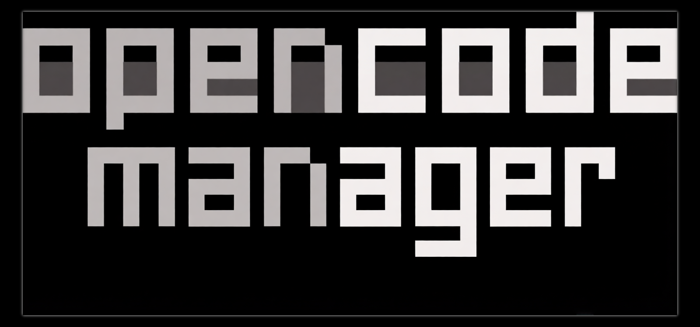

<p align="center">
    
</p>

<p align="center">
    <strong>A self-hosted command center for <a href="https://opencode.ai">OpenCode</a>. Sessions, git, terminal, and schedules in one web app.</strong>
</p>

<p align="center">
    <a href="https://opencodemanager.app">opencodemanager.app</a>
</p>

<p align="center">
    <a href="https://github.com/chriswritescode-dev/opencode-manager/blob/main/LICENSE">
        
    </a>
    <a href="https://github.com/chriswritescode-dev/opencode-manager/stargazers">
        
    </a>
    <a href="https://github.com/chriswritescode-dev/opencode-manager/releases/latest">
        
    </a>
    <a href="https://github.com/chriswritescode-dev/opencode-manager/pulls">
        
    </a>
</p>

<p align="center">
  
  <br />
  
  
</p>

## Theme Showcase

Explore all 37 themes, including matching syntax highlighting for Markdown code blocks.

https://github.com/user-attachments/assets/4f155632-4b03-412e-976f-2a02045caf22

## Requirements

OpenCode Manager requires **OpenCode 2.x at 2.0.15 or newer** (bundled 2.0.15); OpenCode 1.x is not supported. Upgrading from 1.x? See the [v1 → v2 migration guide](https://opencode.ai/v2/docs/migrate-v1). OpenCode 2 migrates V1 session history in the background on first start, so older sessions can be incomplete until it finishes; progress is reported at `GET /api/experimental/migration/v1`.

## Quick Start

Requires Docker with Compose v2.

```bash
curl -fsSL https://opencodemanager.app/install | sh
```

The installer pulls the published image into `~/opencode-manager`, starts it, and opens on http://localhost:5003. It asks before sharing anything from your machine: importing an existing OpenCode config and chat history, sharing a folder of repositories, and allowing sign-in from your phone on the same network. Re-run it to update.

Prefer to run Compose yourself with the published image:

```bash
mkdir opencode-manager && cd opencode-manager
curl -fsSL https://raw.githubusercontent.com/chriswritescode-dev/opencode-manager/main/docker-compose.release.yml -o docker-compose.yml
docker compose up -d
```

Or build from source: in a clone of this repository, `docker-compose.yml` builds the image from the checkout, so `docker compose up -d --build` and `./scripts/docker-upgrade.sh` work as before.

On first launch, you'll be prompted to create an admin account. `AUTH_SECRET` is generated on first start and kept in the data volume when you don't set one.

For local development setup, see the [Development Guide](https://opencodemanager.app/docs/development/setup).


## Features

- **Repositories & Git** — Multi-repo management, local discovery, SSH auth, worktrees, unified diffs, branch and commit management
- **Chat & Sessions** — Real-time SSE streaming, slash commands, `@file` mentions, Plan/Build modes, Mermaid diagram rendering
- **Multi-run & Goals** — Send one prompt to up to 5 models and fuse the results in a new worktree; set session goals and permission modes
- **Files** — Directory browser with tree view, syntax highlighting, create/rename/delete, ZIP download
- **Terminal & Preview** — Repo terminals, project actions, and an authenticated dev-server preview
- **Assistant Mode** — Dedicated AI workspace with auto-provisioned skills for schedules, notifications, settings, and repo operations
- **Schedules** — Recurring repo jobs on cron or interval in fresh, kept, or shared worktrees, with reusable prompts, attached MCP servers, run history, and linked sessions
- **MCP Servers** — Add, configure, authenticate, and manage local or remote MCP servers with OAuth support
- **AI Configuration** — Model/provider setup, API keys, OAuth for Anthropic and GitHub Copilot, custom agent definitions
- **Skills** — Extend agent capabilities with shareable, scoped skill definitions
- **Notifications** — Push notifications for session events, questions, errors, and completions
- **Audio** — Text-to-speech and speech-to-text (browser native and OpenAI-compatible APIs)
- **Agent Sandboxing** — Optional microVM isolation for agent shell commands
- **Themes** — Light/dark/system appearance plus a color theme picker with the Manager default and 36 bundled OpenCode palettes
- **Mobile & PWA** — Responsive mobile-first UI, installable on any device, iOS-optimized

## Architecture

OpenCode Manager is a pnpm workspace with four TypeScript packages:

- `backend/` — Bun + Hono API server with Better Auth, SQLite migrations, OpenCode process management, SSE, schedules, and push notifications.
- `frontend/` — React + Vite SPA using React Router, TanStack Query, Radix UI/Tailwind, service worker support, and mobile-first navigation.
- `shared/` — shared Zod schemas, config helpers, types, and utilities consumed by both backend and frontend.
- `ocm-cli/` — `ocm` CLI that attaches your local OpenCode TUI to a repo hosted on the Manager.

Guides, feature docs, configuration, and troubleshooting are published at [opencodemanager.app/docs](https://opencodemanager.app/docs).

## Development

This repo uses pnpm workspaces for `shared`, `backend`, `frontend`, and `ocm-cli`.

```bash
pnpm install
pnpm dev
pnpm lint
pnpm typecheck
pnpm test
```

See the [Development Guide](https://opencodemanager.app/docs/development/setup) for local setup, scripts, database notes, and testing.

## Configuration

```bash
# Generated automatically in Docker; required for production outside Docker
AUTH_SECRET=your-secure-random-secret  # Generate with: openssl rand -base64 32

# Pre-configured admin (optional)
ADMIN_EMAIL=admin@example.com
ADMIN_PASSWORD=your-secure-password

# For LAN/remote access
AUTH_TRUSTED_ORIGINS=http://localhost:5003,https://yourl33tdomain.com
AUTH_SECURE_COOKIES=false  # Set to true when using HTTPS
```

For OAuth, Passkeys, Push Notifications (VAPID), and advanced configuration, see the [Configuration Guide](https://opencodemanager.app/docs/configuration/environment).

## `ocm` CLI

OpenCode Manager ships an `ocm` CLI (from `ocm-cli/`) that attaches your local OpenCode TUI to a repo hosted on the Manager. It lists ready repos, attaches with `opencode --server` through the Manager's repo-scoped `/api/opencode-proxy/repos/:repoId` route (so prompts run on the Manager's filesystem against a single shared OpenCode server), and can sync the working tree up or down with `ocm push` / `ocm pull` (fast git bundle + working-tree patch by default; pass `--full` for the legacy tarball mirror). Running `ocm` inside a local clone attaches to the Manager repo with the same OpenCode project id (derived from the `origin` remote, else the cached id, else the root commit). Its TUI plugin adds `/ocm-move`, `/ocm` (switch server), `/ocm-goal` and `/ocm-multirun`.

See the [`ocm` CLI guide](https://opencodemanager.app/docs/ocm-cli) for setup and commands.

## Documentation

- [Getting Started](https://opencodemanager.app/docs/getting-started/installation) — Installation and first-run setup
- [Features](https://opencodemanager.app/docs/features/overview) — Deep dive on all features
- [Configuration](https://opencodemanager.app/docs/configuration/environment) — Environment variables and advanced setup
- [Troubleshooting](https://opencodemanager.app/docs/troubleshooting) — Common issues and solutions
- [Development](https://opencodemanager.app/docs/development/setup) — Contributing and local development
- [`ocm` CLI](https://opencodemanager.app/docs/ocm-cli) — Attach local OpenCode TUI to Manager repos

## License

MIT
