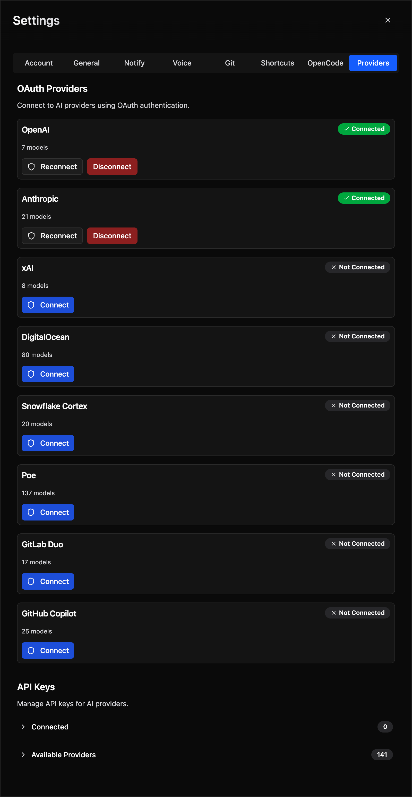

# AI Configuration

Configure AI models, providers, and custom agents.

## Model Selection

### Quick Model Switcher

A compact model switcher is embedded directly in the chat interface. Click the **model name** in the prompt area or chat header to open the quick-select popover:

| Item | Description |
|------|-------------|
| **Active model** | Shown at the top with a checkmark. Click the star icon to add or remove from favorites. |
| **Favorites** | Pinned models always appear first in the list. |
| **Recents** | Last 10 used models appear below favorites (excluding the active one and any favorites). |
| **Variants** | Some models offer tier options (e.g., fast or pro). Variant items are highlighted and show a checkmark on the active selection. |
| **All Models…** | Opens the full model browser when you need a model not in recents or favorites. |

Model selections persist across page reloads.

### Per-Agent Model Selection

Each agent can use a different model independently:

1. Select an agent in the chat session header
2. Open the quick model switcher
3. Choose a model — it is now stored for that agent

When you switch agents, the model you last used with that agent is restored automatically. Your global model selection is unaffected.

### Full Model Browser

To browse all available models:

1. Click **All Models…** in the quick-select popover
2. Filter by provider or search by name
3. Click a model to select it

### Changing Models Mid-Session

You can switch models at any point during a session without losing context. The new model is used for all subsequent messages.

## Providers

Configure API keys or OAuth for AI providers.



### API Key Method

1. Go to **Settings > Providers**
2. Select a provider (OpenAI, Anthropic, etc.)
3. Enter your API key
4. Click **Save**

### OAuth Method

For providers that support OAuth (Anthropic, GitHub Copilot):

1. Go to **Settings > Providers**
2. Select a provider with the OAuth badge
3. Click **Add OAuth**
4. Choose authorization method:
   - **Open Authorization Page** - Opens browser for sign-in
   - **Use Authorization Code** - Provides code for manual entry
5. Complete the authorization flow

### Testing Credentials

After adding credentials:

1. Open a chat session and click the model selector
2. Models from that provider should appear
3. Select a model and try sending a message

If models don't appear, verify your API key and check for errors.

## Custom Agents

Create specialized AI agents with custom configurations.

### Creating an Agent

1. Go to **Settings > Agents**
2. Click **Create Agent**
3. Configure:
   - **Name** - Display name for the agent
   - **Description** - What this agent does
   - **System Prompt** - Instructions for the AI
   - **Default Model** - Model to use
   - **Allowed Tools** - Which MCP tools it can access

4. Click **Save**

### System Prompt Tips

Write effective system prompts:

```
You are a code review expert specializing in TypeScript and React.

When reviewing code:
1. Check for type safety issues
2. Look for potential bugs
3. Suggest performance improvements
4. Ensure consistent code style

Be concise but thorough. Prioritize issues by severity.
```

### Tool Permissions

Control which MCP tools an agent can use:

- **All Tools** - Access to everything
- **Selected Tools** - Only specific tools
- **No Tools** - Pure conversation, no tool access

This is useful for:

- Security-focused agents that shouldn't modify files
- Research agents that only need read access
- Specialized agents for specific tasks

### Using Custom Agents

1. Start a new session
2. Click the agent selector
3. Choose your custom agent
4. Chat with the specialized agent

## Context Usage

Monitor token usage with the context indicator:

- Progress bar shows current usage
- Updates as conversation grows
- Warning when approaching limits

### Managing Context

When context is running low:

1. Use `/compact` to summarize history
2. Start a new session with `/new`
3. Be more concise in prompts
4. Remove unnecessary file mentions

### Context Limits

Different models have different context limits. Check your provider's documentation for exact limits per model.

## Replace the Global OpenCode Config Directory

OpenCode's configuration lives in a directory — `workspace/.config/opencode` — that holds the config file, `AGENTS.md`, `agents/`, `commands/`, `skills/`, `plugin/` and any other files you keep there. In **Settings > OpenCode**, you can replace the entire directory at once by dragging a folder onto the drop zone (or choosing a folder), instead of importing only a config file.

### What Happens

- The whole `workspace/.config/opencode` tree is replaced — the config file, `AGENTS.md`, `agents/`, `commands/`, `skills/`, `plugin/` and any other files the directory holds. The exact destination path is shown in the confirmation dialog before you confirm.
- The folder must contain `opencode.json` or `opencode.jsonc` at its root. An uploaded `.jsonc` file is installed as `opencode.json` with its comments preserved; when both are uploaded, the `.jsonc` is skipped.
- The uploaded config becomes the **default** config shown in the config manager.
- `node_modules`, `.git` and `.DS_Store` entries are skipped. An existing `node_modules` directory at the root of the config directory is carried over unchanged across the replace, so plugin dependencies do not have to be re-uploaded; OpenCode installs the plugins declared in the config's `plugin` array on start.
- Files whose contents start with a `#!` shebang are restored as executable.
- At most 5000 files can be uploaded, with a combined upload size limited by `MAX_UPLOAD_SIZE_MB` (50 MB by default).
- The OpenCode server restarts afterwards.

### Restart Required

Changes that need a restart surface as an amber notice pinned at the top of the **OpenCode** tab in Settings while a restart is pending. The notice appears when a change has been saved but not yet applied to the running server — a directory replace restarts the server for you, so it only shows up after one if that restart never came up healthy. The first time a pending restart is seen, a confirmation dialog opens automatically; you can dismiss it with **Later**. The **Restart Now** button restarts the server immediately when no sessions are working, and asks for confirmation first when sessions are working, reporting how many would be interrupted.

### If the Replacement Breaks Startup

If an uploaded `plugin/**` prevents OpenCode from starting, upload a corrected directory again. Automatic recovery restores only `opencode.json`, so a bad plugin can only be fixed by re-uploading a working directory.
