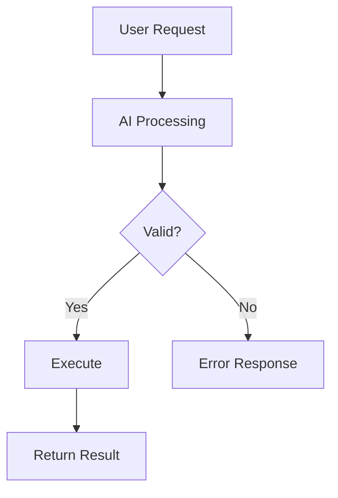

# Chat & Sessions

Real-time chat interface for interacting with AI agents.

## Real-time Streaming

Messages stream in real-time using Server-Sent Events (SSE):

- See responses as they're generated
- No waiting for complete responses
- Can interrupt generation if needed


## Background Work

While a shell command or subagent is running, **Move to background** above the prompt lets it keep running while the session continues. The background tasks bar lists each background shell and subagent with its status:

- **running** - still working
- **completed** / **failed** - finished, using the shell exit code or the subagent outcome
- **killed** - you stopped the shell from the bar
- **interrupted** - the subagent was interrupted
- **unavailable** - OpenCode no longer knows the shell and the session has no completion notice for it

Shell rows can show live output and be killed; subagent rows open the child session. Statuses are reconciled when the connection returns, so work that finished while you were away is shown as finished. After a page reload, a shell you killed is shown as **failed**, which matches OpenCode's own notice for it.

## Model Selection

Click the **model name** in the chat prompt area to open the quick model switcher, where you can switch models, mark favorites, and pick variants without leaving the chat. Each agent keeps its own model selection. See [AI Configuration](ai-config.md#model-selection) for the full reference.

## Slash Commands

Type `/` to see available commands. Built-in commands are covered in the [Quick Start](../getting-started/quickstart.md#useful-commands). OpenCode's own commands, such as `/init` and `/review`, appear in the same list.

The fork keyboard shortcut opens the same message picker as `/fork`.

### Custom Commands

Create your own commands in **Settings > Custom Commands**:

```yaml
name: review
description: Request a code review
template: |
  Please review the following code for:
  - Security vulnerabilities
  - Performance issues
  - Best practices
  - Code style
  
  {{selection}}
```

Use with `/review` in chat. A custom command with the same name as a built-in command replaces the built-in.

## File Mentions

Reference files and folders in prompts with `@`. Type `@`, start typing a name, and select from the autocomplete dropdown; the AI then has access to that file's contents.

### Multiple Files

You can mention multiple files in one message:

```
@src/components/Button.tsx @src/styles/button.css
Can you refactor the Button component to use CSS modules?
```

### Folder Mentions

Mention entire folders to include all files:

```
@src/utils/
Review all utility functions for consistency
```

## Plan/Build Mode

Toggle between two operational modes:

### Plan Mode (Read-Only)

- AI can read and analyze files
- AI cannot modify, create, or delete files
- Safe for exploration and planning

### Build Mode (Full Access)

- AI can create new files
- AI can edit existing files
- AI can delete files
- Use for implementation tasks

Toggle modes using the mode selector in the chat header.

## Permission modes

Control who answers OpenCode permission requests for a session. The shield button in the composer toggles between two modes:

- **Ask every time** (default) - each permission request waits for you in the permission dialog.
- **Accept everything** - every "ask" request is answered automatically.

The mode is owned by the backend, so a session in Accept everything keeps working while the browser is closed. Accept everything answers each request once and never saves a permanent rule, and it never overrides a `deny` rule. When you switch a session to Accept everything, requests already waiting are answered immediately.

Child sessions inherit the mode of their root session and cannot change it, and the composer toggle is disabled for them with an explanation. A session forked from another starts with the source session's mode, except that forks of scheduled runs stay **Ask every time**.

Sessions started by a scheduled run always use their schedule's own permission configuration; the composer toggle is disabled there with an explanation. Sessions created or forked by an agent through the `ocm` tool always start in **Ask every time**, regardless of the default, though an agent can still send follow-ups to a session you switched to **Accept everything**.

If Manager restarts or loses its connection to OpenCode, permission requests already waiting in **Accept everything** sessions are answered when it reconnects.

To change the default for new sessions, go to **Settings → General → Sessions** and pick a **Default permission mode for new sessions**. The default is stamped onto a session when it is created, so changing it only affects sessions created afterwards, never existing ones.

Auto-accepted requests send no push notification, so you are not alerted for a request the session answered itself.

## Session goals

A goal keeps a session working on an objective until an auditor model decides it is done or blocked, without you sending follow-up messages.

Arm goal mode with the target button in the composer, then send your message. That message becomes the goal objective, and it is sent to the session as usual. Goals cannot be started on scheduled-run sessions or subagent (child) sessions, and the goal button is disabled there. If you arm a goal and send while the agent is still responding, the message is queued and the goal starts; auditing begins after that queued turn. While a goal is active, each time the session goes idle the auditor decides the next step:

- **done** - the objective is verifiably achieved, and the goal completes.
- **blocked** - the agent needs a decision or access it cannot obtain. Three consecutive blocked verdicts stop the goal as blocked.
- **continue** - the agent keeps working toward the objective.

The auditor only sees the objective and the agent's latest reply; it cannot run tools or read files. Automatic continuations are capped by **Max automatic continuations**, and you can also set a **Token budget per goal** to stop a goal once it has spent that many tokens. A failed turn stops the goal, an interrupted turn pauses it, and deleting the session stops it.

The goal is persisted and driven by the backend, so it survives closing the browser and a Manager restart: an active goal resumes auditing once the session is idle again.

A status bar above the message list shows the goal state, the turn count, token usage, and the latest reason, with **Pause** (or **Resume**), **Cancel**, and **Dismiss** actions.

Goal settings live in **Settings → General → Sessions**:

- **Goal auditor model** - the model that decides whether the goal is done, as `provider/model`. Leave empty to use the OpenCode default model.
- **Max automatic continuations** - how many times a goal may continue before it stops (1-200, default 20).
- **Token budget per goal** - stop once the goal has spent this many tokens. Empty means no limit.

## Mermaid Diagrams

AI responses can include Mermaid diagrams that render automatically:



Supported diagram types:

- Flowcharts
- Sequence diagrams
- Class diagrams
- State diagrams
- Entity-relationship diagrams
- Gantt charts
- And more...

## Session Management

### Viewing Sessions

Access your sessions from the sidebar:

- Sessions are organized by repository; the current repository is expanded and one repository is open at a time
- Pinned sessions appear first, followed by the most recent sessions
- A live indicator marks sessions that are working, retrying, or compacting
- **All sessions** opens the repository's full session list when it has more sessions than the sidebar shows
- Repositories that are still cloning, or whose clone failed, show **Repository not ready** until they are ready
- On desktop, type in the sidebar search box and press **Enter** to search sessions across all repositories; press **Escape** to clear
- Click a session to resume


### Searching Sessions

Find sessions by content:

1. Click the search icon in the sessions panel
2. Type your search query
3. Results show sessions with matching content

### Pinning Sessions

Pin important sessions to the top of the list. See [Session Pinning](session-pins.md) for details.

### Deleting Sessions

Remove sessions you no longer need:

1. Hover over a session
2. Click the delete icon
3. Confirm deletion

### Bulk Delete

Remove multiple sessions at once:

1. Click **Select** in the sessions panel
2. Check sessions to delete
3. Click **Delete Selected**
4. Confirm deletion

## Context Management

Sessions maintain context of your conversation. As context grows, you may need to manage it:

### Compacting Context

Use `/compact` to reduce context size:

- Summarizes earlier messages
- Preserves important information
- Frees up context for new messages

### Starting Fresh

Use `/new` to start a new session when:

- Context is too large
- Topic has changed significantly
- You want a clean slate

## Keyboard Shortcuts

| Shortcut | Action |
|----------|--------|
| `↑` | Edit last message |
| `/` | Open command menu |
| `@` | Open file mention menu |
| `Escape` | Close autocomplete menus |
