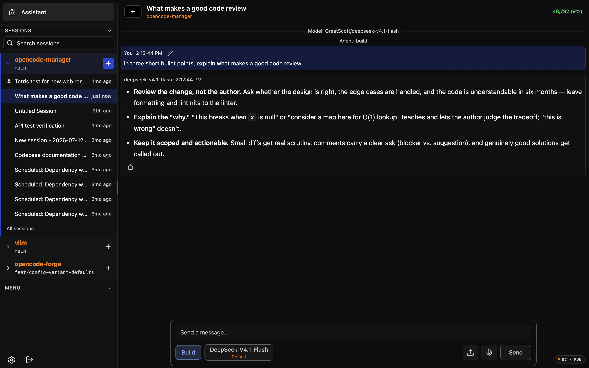
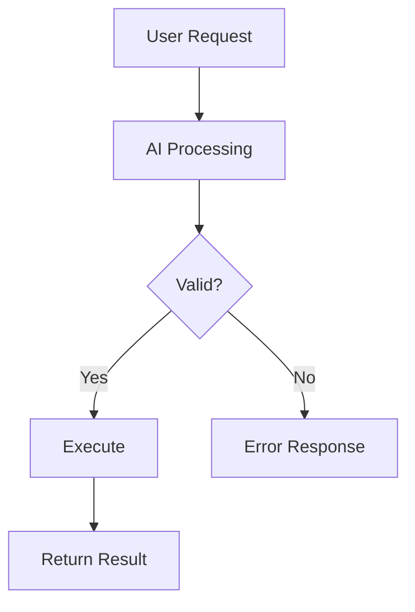
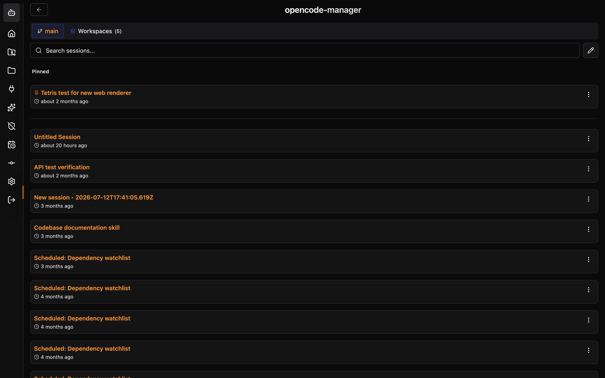

# Chat & Sessions

Real-time chat interface for interacting with AI agents.

## Real-time Streaming

Messages stream in real-time using Server-Sent Events (SSE):

- See responses as they're generated
- No waiting for complete responses
- Can interrupt generation if needed



## Background Work

While a shell command or subagent is running, **Move to background** above the prompt lets it keep running while the session continues. The background tasks bar lists each background shell and subagent with its status:

- **running** - still working
- **completed** / **failed** - finished, using the shell exit code or the subagent outcome
- **killed** - you stopped the shell from the bar
- **interrupted** - the subagent was interrupted
- **unavailable** - OpenCode no longer knows the shell and the session has no completion notice for it

Shell rows can show live output and be killed; subagent rows open the child session. Statuses are reconciled when the connection returns, so work that finished while you were away is shown as finished. After a page reload, a shell you killed is shown as **failed**, which matches OpenCode's own notice for it.

## Model Selection

Click the **model name** in the chat prompt area to open the quick model switcher, where you can switch models, mark favorites, and pick variants without leaving the chat. Each agent keeps its own model selection. See [AI Configuration](ai-config.md#model-selection) for the full reference.

## Slash Commands

Type `/` to see available commands. Built-in commands are covered in the [Quick Start](../getting-started/quickstart.md#useful-commands).

### Custom Commands

Create your own commands in **Settings > Custom Commands**:

```yaml
name: review
description: Request a code review
template: |
  Please review the following code for:
  - Security vulnerabilities
  - Performance issues
  - Best practices
  - Code style
  
  {{selection}}
```

Use with `/review` in chat.

## File Mentions

Reference files and folders in prompts with `@`. Type `@`, start typing a name, and select from the autocomplete dropdown; the AI then has access to that file's contents.

### Multiple Files

You can mention multiple files in one message:

```
@src/components/Button.tsx @src/styles/button.css
Can you refactor the Button component to use CSS modules?
```

### Folder Mentions

Mention entire folders to include all files:

```
@src/utils/
Review all utility functions for consistency
```

## Plan/Build Mode

Toggle between two operational modes:

### Plan Mode (Read-Only)

- AI can read and analyze files
- AI cannot modify, create, or delete files
- Safe for exploration and planning

### Build Mode (Full Access)

- AI can create new files
- AI can edit existing files
- AI can delete files
- Use for implementation tasks

Toggle modes using the mode selector in the chat header.

## Mermaid Diagrams

AI responses can include Mermaid diagrams that render automatically:



Supported diagram types:

- Flowcharts
- Sequence diagrams
- Class diagrams
- State diagrams
- Entity-relationship diagrams
- Gantt charts
- And more...

## Session Management

### Viewing Sessions

Access your sessions from the sidebar:

- Sessions are organized by repository; the current repository is expanded and one repository is open at a time
- Pinned sessions appear first, followed by the most recent sessions
- A live indicator marks sessions that are working, retrying, or compacting
- **All sessions** opens the repository's full session list when it has more sessions than the sidebar shows
- Repositories that are still cloning, or whose clone failed, show **Repository not ready** until they are ready
- On desktop, type in the sidebar search box and press **Enter** to search sessions across all repositories; press **Escape** to clear
- Click a session to resume



### Searching Sessions

Find sessions by content:

1. Click the search icon in the sessions panel
2. Type your search query
3. Results show sessions with matching content

### Pinning Sessions

Pin important sessions to the top of the list. See [Session Pinning](session-pins.md) for details.

### Deleting Sessions

Remove sessions you no longer need:

1. Hover over a session
2. Click the delete icon
3. Confirm deletion

### Bulk Delete

Remove multiple sessions at once:

1. Click **Select** in the sessions panel
2. Check sessions to delete
3. Click **Delete Selected**
4. Confirm deletion

## Context Management

Sessions maintain context of your conversation. As context grows, you may need to manage it:

### Compacting Context

Use `/compact` to reduce context size:

- Summarizes earlier messages
- Preserves important information
- Frees up context for new messages

### Starting Fresh

Use `/new` to start a new session when:

- Context is too large
- Topic has changed significantly
- You want a clean slate

## Keyboard Shortcuts

| Shortcut | Action |
|----------|--------|
| `↑` | Edit last message |
| `/` | Open command menu |
| `@` | Open file mention menu |
| `Escape` | Close autocomplete menus |
