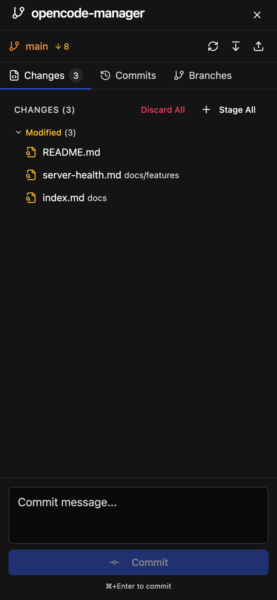
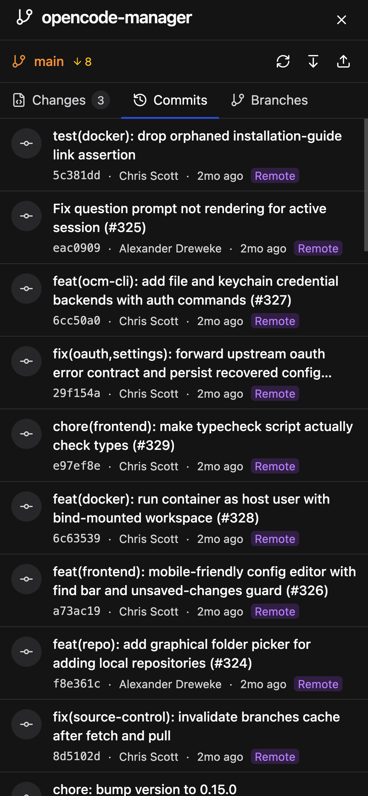
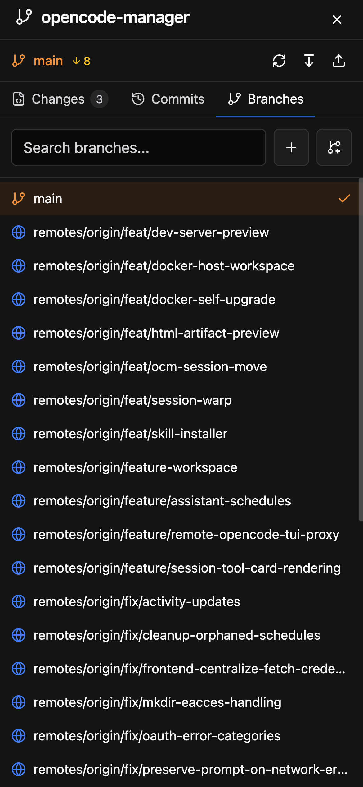
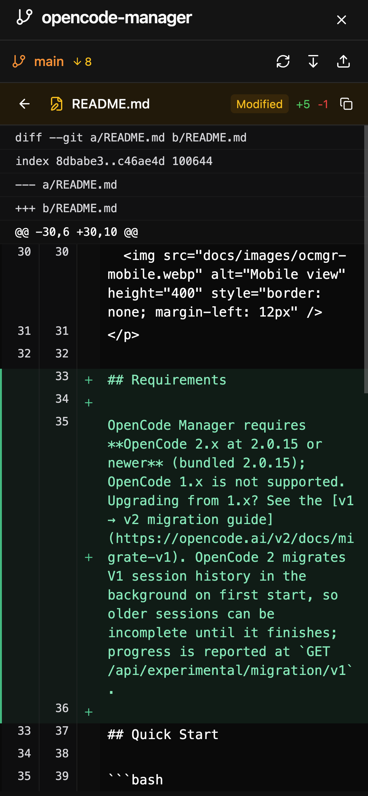

# Repository & Git

Comprehensive git integration for managing repositories and source control.

## Cloning Repositories

Clone any git repository:

1. Click the **Repositories** button in the sidebar
2. Click **Clone Repository**
3. Paste the repository URL
4. Click **Clone**

## Discovering Existing Repositories

Import repositories you already have on disk without recloning them:

1. Click the **Repositories** button in the sidebar
2. Click **Add Repository**
3. Select **Folder Discovery**
4. Enter a parent folder such as `/Users/you/Development`
5. Click **Discover Repositories**

OpenCode Manager scans that folder for nested git repositories and links each one into the workspace. If standalone OpenCode already has chats stored for those same paths, the sessions show up automatically.

### Private Repositories

For private repositories, configure a GitHub Personal Access Token:

1. Go to **Settings > Git > Credentials**
2. Enter your GitHub PAT
3. Ensure the token has `repo` scope

### SSH Repositories

SSH key authentication added for git repositories. Configure SSH keys in Settings > Git > Credentials.

## Git Worktrees

Work on multiple branches simultaneously without switching:

1. Select a repository
2. Click **Create Worktree**
3. Choose **New branch** (enter a name and pick a base branch) or **Existing branch** (pick a local or remote branch to check out)
4. A new workspace is created with that branch checked out

Worktrees share the same git history but have independent working directories. This is useful for:

- Comparing implementations across branches
- Working on a feature while keeping main branch accessible
- Testing changes without disrupting your main work

### Integrating a Worktree Branch

From a worktree's Branches tab, click **Integrate** to bring its commits into another branch:

1. Choose the target branch. It must be checked out cleanly in another managed worktree, with no uncommitted changes or operation already in progress.
2. Choose a strategy: **Merge commit** integrates all commits with a merge commit, while **Cherry-pick commits** replays each commit onto the target.
3. Click **Integrate**.

If the target stops on conflicts, the operation banner appears in the dialog so you can resolve, continue, or abort the integration.

### Deleting a Worktree

Deleting a worktree offers three branch options:

- **Keep branch** - Leave the branch in the parent repository.
- **Delete local branch** - Remove the branch from the parent repository.
- **Delete local and remote branch** - Also delete the branch from origin.

**Delete local branch** and **Delete local and remote branch** use a safe delete: if the branch has unmerged commits it is kept (and the remote branch is not deleted either), and a warning names it. Force-delete it from the Branches tab if intended.

## Source Control Panel

Access comprehensive git operations via the source control button.

### Changes Tab

- View all modified, added, deleted, and untracked files
- Stage/unstage individual files or all changes
- Discard changes to revert modifications
- View diffs inline for any changed file

{ .phone }

### Commits Tab

- Browse commit history
- View commit details including message, author, and date
- See file changes in each commit
- Track ahead/behind status with remote

{ .phone }

### Branches Tab

- List all local and remote branches
- Create new branches from current HEAD
- Switch branches (checks out the branch)
- Rename a local branch from its actions menu. Renaming also updates the base branch of schedules in every checkout of the same git repository that used the old name. A worktree's folder keeps the old branch name; `ocm` mirroring looks for a folder named after the new branch, so mirroring the renamed branch fails while that worktree exists.
- Delete local branches, optionally force-deleting an unmerged branch and, when the branch tracks a remote, also deleting the remote branch. The current branch and branches checked out in another worktree cannot be deleted.

{ .phone }

### Stash Tab

Stash work in progress and restore it later:

- Enter an optional message and choose whether to include untracked files
- **Stash changes** saves the working tree and index
- Each stash shows its branch and date, with **Apply** (restore and keep the stash), **Pop** (restore and remove the stash), and **Drop** (delete the stash)
- The stash list is shared by a repository and all its worktrees. Apply, Pop, and Drop verify the stash is still the one shown and ask you to refresh if the list changed.

### Merge, Rebase and Cherry-pick Conflicts

When a merge, rebase, or cherry-pick stops on conflicts, an operation banner appears at the top of the source control panel:

- Shows the operation kind and the list of conflicted files
- **Continue** finishes the operation once every conflict is resolved
- **Abort** cancels the operation and restores the previous state
- **Resolve with agent** opens a new session in the repository, primed with the conflicted files, so an agent can resolve them

### Committing

Commit staged changes with a message. Press ⌘/Ctrl+Enter to commit without clicking the button.

#### AI Commit Messages

Use the sparkle button in the commit box to generate a commit message from the staged changes using OpenCode's default model. Only staged changes are used, and the generated message replaces the current text after confirmation.

#### Commit Identities

Configure identities in **Settings > Git**:

- **Default identity** - Written to Manager's own git config file (`.config/git/config` in the workspace). When the name or email is empty and a GitHub token credential is configured, the missing parts come from the GitHub account. It applies to Manager commits, agent shells, terminals, and scheduled runs without restarting OpenCode. Because it is a global-level git config file, a repository's own identity and, on non-Docker installs, your `~/.gitconfig` identity take precedence over it.
- **Saved identities** - Presets that can be applied to individual repositories.

Each repository has a **Commit as** selector in the commit box. Choosing a saved preset writes it into the repository's local git config (`user.name` / `user.email`), which git shares with all worktrees of the repository (Manager worktrees, OpenCode workspaces, and scheduled-run worktrees). Choosing **Default** removes the repository's local identity. An identity you set yourself in the repository's local git config is respected and shown as **Custom**; the selector asks before replacing it. The selector shows the effective identity and where it comes from (repository, Manager default, git global config, or not configured). Removing a saved preset does not change repositories that use it.

Sandboxed shells receive the resolved identity for their directory.

## Diff Viewer

View file changes with a unified diff format:

- **Line Numbers** - Both old and new line numbers displayed
- **Syntax Highlighting** - Code is highlighted based on file type
- **Change Markers** - Additions in green, deletions in red
- **Change Counts** - Summary of lines added/removed

### Accessing Diffs

- Click any changed file in the Source Control panel
- Diffs appear inline or in a modal depending on context
- Use the expand/collapse toggle for large diffs

{ .phone }

## Repository Actions

### Pull

Fetch and merge remote changes:

1. Select a repository
2. Click the **Pull** button
3. Changes are fetched and merged

### Fetch

Download remote changes without merging:

1. Select a repository
2. Click the **Fetch** button
3. Remote tracking branches are updated

### Delete Repository

Remove a repository from the workspace:

1. Select a repository
2. Click **Delete**
3. Confirm deletion

## Ahead/Behind Tracking

The UI shows your branch's relationship to its remote:

- **↑ N** - You have N commits not pushed to remote
- **↓ N** - Remote has N commits you haven't pulled
- **↑ N ↓ M** - Both local and remote have diverged
