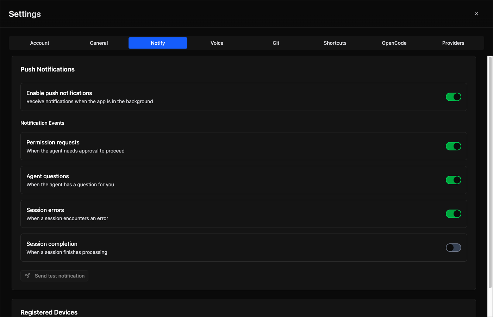

# Push Notifications

Send background notifications when the OpenCode Manager PWA is closed, keeping you informed of agent activity without keeping the app open.

## Overview

Push notifications allow you to receive alerts on your mobile device or desktop when:

- The **agent needs permission** to continue (file operations, tool use, etc.)
- The **agent has a question** for you (clarifications, confirmations)
- A **session encounters an error** during execution
- A **session completes successfully**

A notification is suppressed when a visible tab is already viewing the session that raised it, preventing duplicate alerts while you're actively monitoring that session. Subagent sessions never notify.

## Supported Events

| Event | Description | Default |
|-------|-------------|---------|
| `permissionAsked` | Agent requests permission for an action | Enabled |
| `questionAsked` | Agent asks a clarifying question | Enabled |
| `sessionError` | Session encounters an error | Enabled |
| `sessionIdle` | Session completes successfully | Disabled |

## Content and Click Behaviour

The title is the action (`Run Command`, `Edit File`, `Question`, `Error`, `Session complete`) and the body is `<repo> · <detail>`, for example `oc-manager · pnpm test`. Bodies are truncated to 140 characters. Permission and question notifications stay on screen until dismissed; every notification carries the event timestamp and re-alerts when a newer event for the same session replaces it.

Clicking a notification opens the session that raised it (`/repos/<id>/sessions/<sessionId>`). The service worker prefers a tab already showing that session, then the focused tab, then any visible tab, and only that one tab navigates; with no tab open a new window is opened. Sessions running in OpenCode workspace worktrees or opencode-forge loop worktrees resolve to their parent repository through the shared OpenCode project id, and Assistant sessions open with the `assistant=1` parameter the Assistant view requires.

## Browser Compatibility

Push notifications require HTTPS (except on `localhost`) and browser support:

| Browser | Support | Notes |
|---------|---------|-------|
| Chrome/Edge | ✅ Full | Works well |
| Firefox | ✅ Full | Works well |
| Safari (iOS/macOS) | ✅ Full | Requires `mailto:` VAPID subject |
| Android browser | ✅ Full | Works well |

### iOS/Safari Requirements

Apple's Push Notification Service (APNs) has strict requirements:

1. **HTTPS is required** - `localhost` testing requires Safari Dev Tools
2. **VAPID_SUBJECT must use `mailto:` format** - `https://` subjects are rejected

**Correct:** `VAPID_SUBJECT=mailto:you@yourdomain.com`  
**Incorrect:** `VAPID_SUBJECT=https://yourdomain.com`

## Setup

### 1. Generate VAPID Keys



Generate VAPID public/private key pair:

```bash
pnpm dlx web-push generate-vapid-keys
```

Output:
```
=======================================
Public Key:
BMx-123456... (your public key here)

Private Key:
abcd1234... (your private key here)

Subject:
mailto:your-email@example.com
=======================================
```

### 2. Configure Environment Variables

Add to your `.env` file:

```bash
VAPID_PUBLIC_KEY=BMx-123456...
VAPID_PRIVATE_KEY=abcd1234...
VAPID_SUBJECT=mailto:you@yourdomain.com
```

### 3. Subscribe Devices

1. Open OpenCode Manager in your browser
2. Go to **Settings** → **Notifications**
3. Click **Enable Push Notifications**
4. Allow browser permission when prompted
5. Your device is now subscribed

## Managing Subscriptions

### View Subscribed Devices

Navigate to **Settings** → **Notifications** to see all registered devices:

- Device name (if provided)
- Subscription date
- Last used timestamp

### Remove a Device

Click **Unsubscribe** next to a device to remove it from receiving notifications.

### Test Notifications

Go to **Settings** → **Notifications** and click **Send Test Notification** to verify your setup is working.

## Notification Preferences

Control which events trigger notifications:

**Notification Settings:**
- **Enable Push Notifications** - Master toggle (default: off)
- **Permission Requested** - Get notified when agent needs permission (default: on)
- **Question Asked** - Get notified when agent has a question (default: on)
- **Session Error** - Get notified on session errors (default: on)
- **Session Complete** - Get notified when session finishes (default: off)
