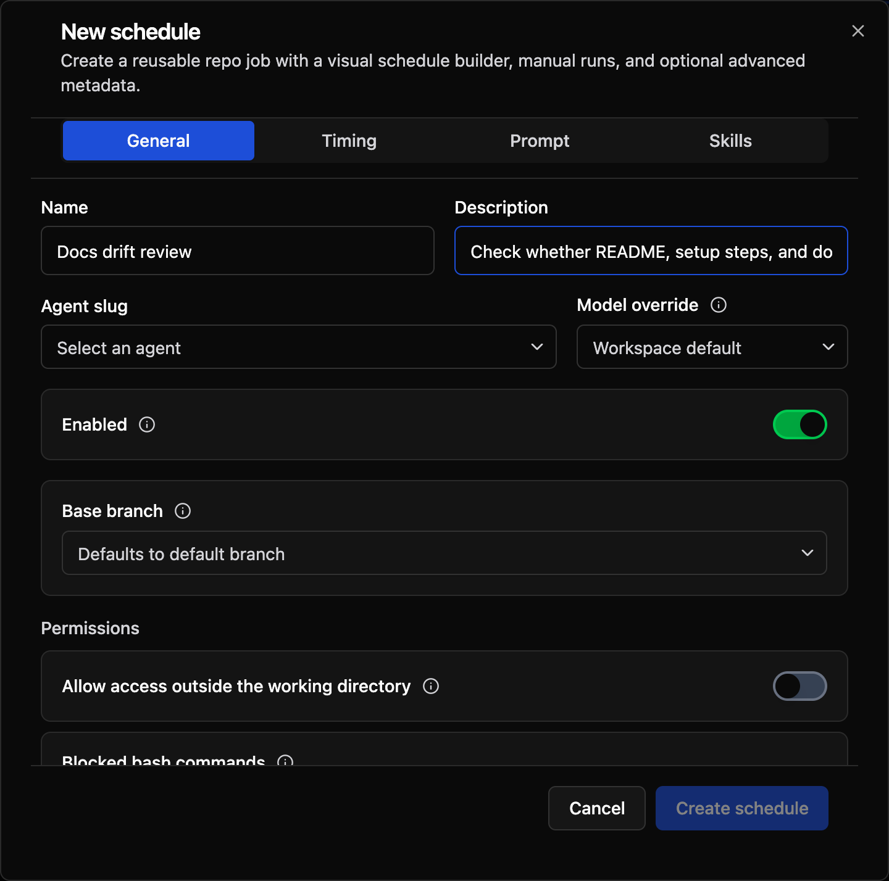
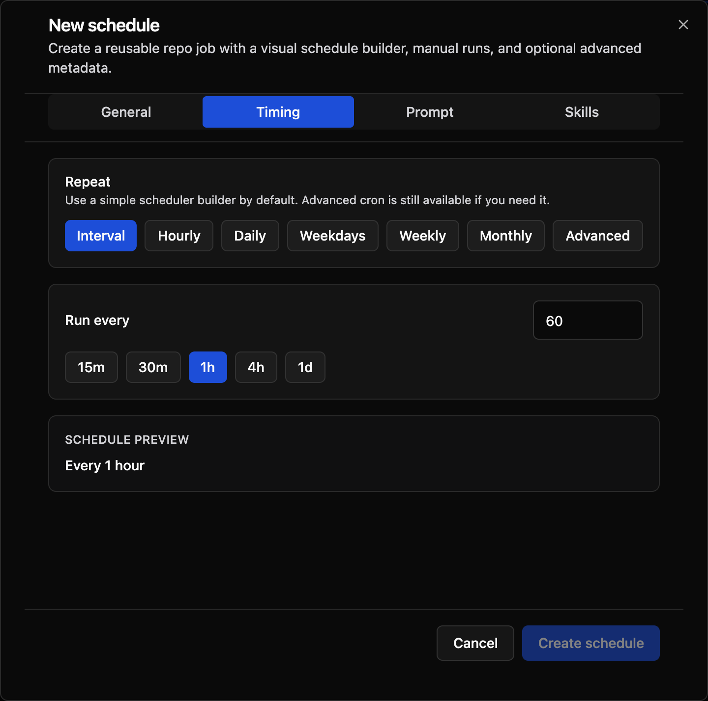
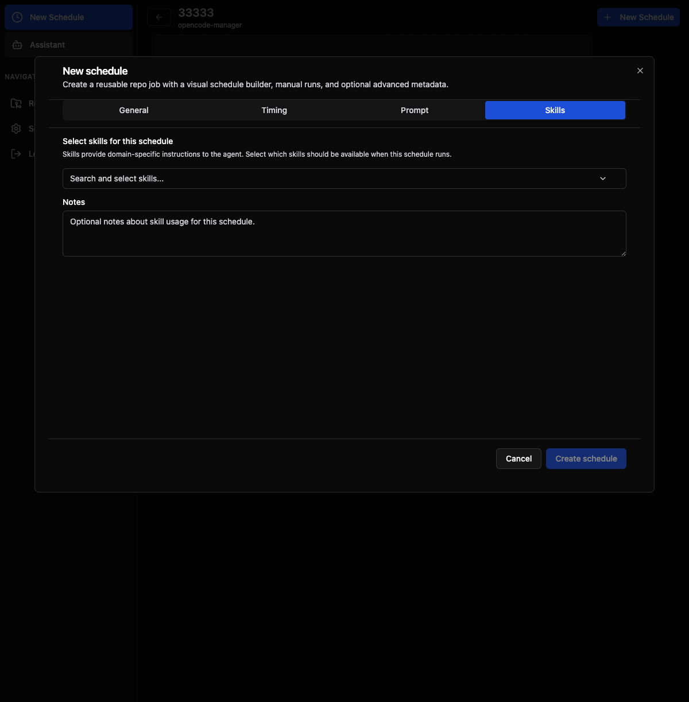
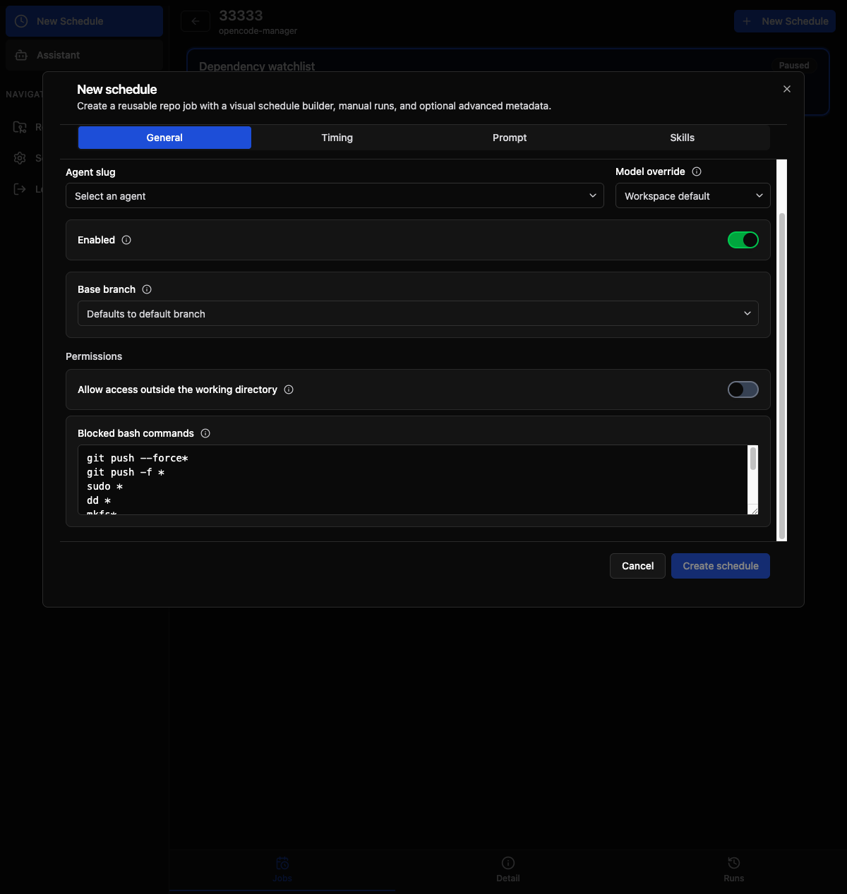
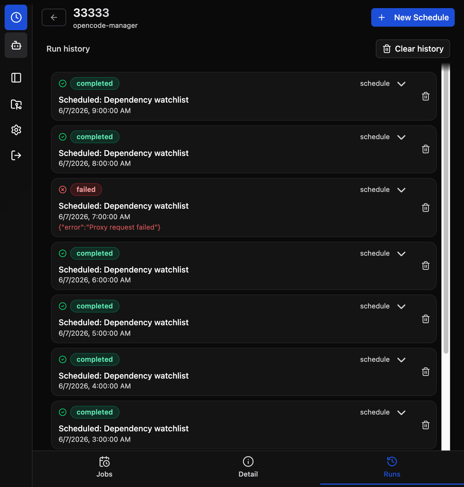

# Schedules & Recurring Jobs

Create recurring repo jobs that run reusable prompts against a repository, store run history, and link every run back to a normal OpenCode session.

## What Schedules Are Good For

Schedules make OpenCode Manager proactive instead of purely session-driven. Good examples include:

- **Repo health reports** for a quick morning review
- **Dependency watchlists** to catch upgrade pressure early
- **Release readiness checks** before a ship window
- **Docs drift reviews** to spot stale setup instructions
- **Tech debt triage** for recurring cleanup planning

Each run is stored with status, timestamps, logs, assistant output, and a linked session you can open and continue.

## Creating a Schedule

1. Open a repository
2. Click **Schedules**
3. Click **New Schedule**
4. Configure the job name, prompt, timing, and optional overrides
5. Save the schedule

The schedule is scoped to the current repository.



## Timing Options

The schedule builder supports both simple presets and advanced cron:

- **Interval** - Repeat every N minutes
- **Hourly** - Run once each hour at a chosen minute
- **Daily** - Run once per day at a chosen time
- **Weekdays** - Run Monday through Friday
- **Weekly** - Pick one or more weekdays and a time
- **Monthly** - Run on a day of the month
- **Advanced** - Enter a cron expression directly

Cron-based schedules also store a timezone so runs happen when expected.



## Prompt Templates

Built-in prompt templates help you start quickly with recurring jobs like:

- Repo health report
- Dependency watchlist
- Release readiness review
- Test stability audit
- Docs drift review
- Tech debt triage
- Security and config review
- CI and ops review

Applying a template fills the schedule name, description, and prompt so you can customize from a strong default instead of starting from scratch.

## Agent and Model Overrides

Schedules can run with:

- the default workspace agent and model
- a custom agent slug
- a specific model override when needed

If a requested model is no longer available, OpenCode Manager falls back to a valid configured model for that provider so the run can still start when possible.

## Skills

Each schedule can optionally attach skill slugs and notes. Skills modify the agent's behavior during the run — for example, you could attach a review-focused skill to a weekly code review schedule.



The **Skills** tab in the schedule dialog lets you:

- Select one or more **skill slugs** from a multi-select input
- Add free-form **notes** (max 2000 characters) that the agent receives as additional context

Skill metadata is passed to the OpenCode workspace config when the run starts, making the selected skills available to the agent for that run only.

## Worktree Isolation

Each scheduled run executes in a **throwaway git worktree** — an isolated working copy branched off the repository's base branch. This provides two key guarantees:

- **No side effects on the main working tree** — file changes, branch switches, and experimentations during the run are confined to the worktree.
- **Clean state per run** — every run starts from a fresh branch (`schedule/{jobId}/run-{runId}`) based off the latest remote state.

When the run completes or fails, the worktree is cleaned up automatically. The worktree is **never auto-pushed** — any changes an agent makes during a scheduled run stay local and are discarded after the run finishes. The real safety boundary is this disposal: modifications affect only the throwaway worktree and are not propagated back to the repository.

### Branch Configuration

By default, runs branch off the repository's default branch. You can override this by specifying a **base branch** in the schedule settings — the worktree branches off your chosen branch instead.


## Permission Configuration

Every schedule includes a **Permissions** section in the General tab. These settings control what the agent can access and execute during unattended runs.



### Allow Access Outside the Working Directory

When **disabled** (the default), the agent's file operations are confined to the isolated worktree. Enable this if the schedule requires reading or writing files elsewhere on the system (e.g., accessing a shared configuration directory).

### Blocked Bash Commands

The following bash command patterns are always blocked by default:

```
git push --force*
git push -f *
sudo *
dd *
mkfs*
shutdown*
reboot*
halt*
kill -9 *
killall *
```

These patterns prevent dangerous commands whose blast radius escapes the throwaway worktree. File-mutating commands (`rm -rf`, `git reset --hard`, etc.) are intentionally omitted because they only affect the disposable worktree.

You can customize the deny list by adding or removing glob patterns. One pattern per line. Changes apply to all future runs of that schedule.

## Run History

Each schedule stores a run history panel with:

- **Status** - Running, completed, or failed
- **Trigger source** - Manual or scheduled
- **Log output** - Execution metadata and captured results
- **Assistant output** - Rendered markdown preview and raw markdown
- **Errors** - Failure details when a run does not complete

This makes recurring jobs easy to review without digging through raw session data first.



## Linked Sessions

Every run creates or attaches to a normal OpenCode session.

Use **Open session** when you want to:

- inspect the original conversation
- continue from the generated report
- answer follow-up questions from the agent
- debug provider, permission, or tool issues

This keeps automation connected to the rest of the OpenCode Manager workflow instead of creating a separate silo.

## Best Practices

- Keep prompts focused on one recurring outcome
- Prefer a few high-value schedules per repo over many overlapping jobs
- Use manual runs to validate a prompt before relying on the schedule
- Review failed runs quickly so broken provider or permission setups do not go unnoticed
- Treat schedules as reusable repo routines, not long-running background workers

## Troubleshooting

### Run Failed

1. Open the run from **Run History**
2. Check the **Error** tab for the failure message
3. Use **Open session** to inspect the underlying session
4. Verify provider credentials, model availability, and any pending agent questions or permissions

### No Assistant Output

If a run starts but does not produce assistant output:

1. Open the linked session
2. Check for a provider error
3. Check whether the agent asked a question or needed permission
4. Re-run the schedule manually after fixing the issue

### Prompt Needs Iteration

Use **Run now** to test prompt changes immediately before waiting for the next scheduled run.
