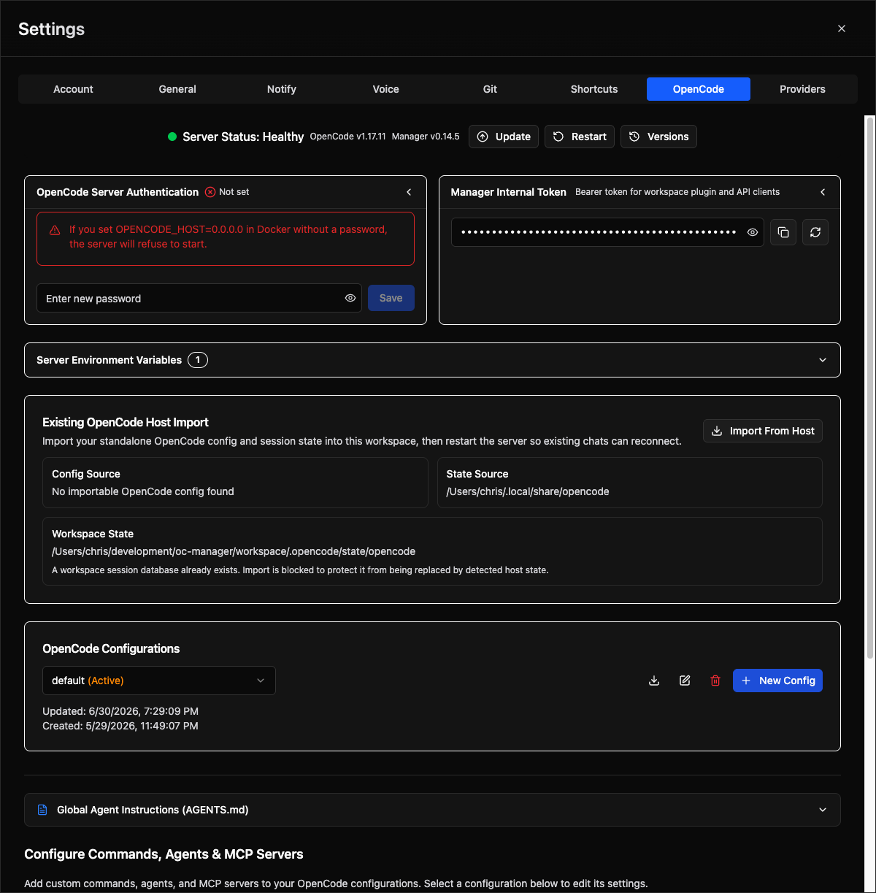

# OpenCode Server Health & Restart

Monitor the managed OpenCode server's status and control restarts and upgrades from the Settings UI.

## Overview

OpenCode Manager runs a supervised OpenCode server process to handle agent sessions. The **OpenCode** tab in Settings shows the server's current status, version information, and provides controls for restarting or upgrading the server without bringing down the Manager itself.

## Server Status

| Indicator | Meaning |
|-----------|---------|
| **Healthy** | The OpenCode server is running and responding to health checks |
| **Unhealthy** | The server is not responding. The Manager will attempt automatic recovery. |
| **Starting** | The server is being initialized after a restart or Manager startup |

The panel also displays:

- **OpenCode version** — The installed version of the OpenCode server (e.g., `v1.17.11`)
- **Manager version** — The current OpenCode Manager version (e.g., `v0.14.5`)

## Health Monitoring

The Manager periodically polls the OpenCode server's health endpoint. If the server becomes unresponsive:

1. The Manager logs the failure and increments a failure counter
2. After a configurable number of consecutive failures (default: 2), automatic recovery begins
3. Recovery restarts the OpenCode server process
4. In-flight sessions are aborted and resumed once the server is healthy again

### Configuration

Health monitoring is configured through environment variables:

| Variable | Default | Description |
|----------|---------|-------------|
| `OPENCODE_HEALTH_WATCH_ENABLED` | `true` | Enable health watcher and recovery (`false` in tests) |
| `OPENCODE_HEALTH_POLL_MS` | `30000` | Poll interval in milliseconds |
| `OPENCODE_HEALTH_FAILURE_THRESHOLD` | `2` | Failed checks before recovery starts |

## Restart with Session Resume

When you restart the OpenCode server (manually or through an upgrade), active sessions are handled gracefully:

1. **Capture** — The Manager captures all active user sessions (excluding subagent and scheduled-run sessions)
2. **Abort** — Active sessions are aborted cleanly on the running server
3. **Restart** — The OpenCode server process is stopped and started fresh
4. **Resume** — Once healthy, a `continue` prompt is automatically sent to each previously active session

### Confirmation

If there are active sessions when you click **Restart**, a confirmation dialog shows how many sessions will be interrupted. You can proceed or cancel.

## Upgrading OpenCode

Click **Update** to check for and install the latest OpenCode version. The process:

1. Checks the currently installed version against the latest available release
2. Downloads and installs the update if available
3. Restarts the server using the same session-resume flow described above
4. The new version is displayed in the status panel after restart

If the upgrade fails but the server recovers to a usable state, a recovery notice is shown with the fallback version.

## Manual Restart Triggers

Besides the explicit **Restart** button, the server is automatically restarted when:

- **OpenCode configuration is saved** — Changes to models, agents, commands, or MCP servers that require a server restart
- **Assistant workspace is reloaded** — Via the `POST /assistant/reload` internal API endpoint
- **Config import completes** — Importing a standalone OpenCode config into the workspace
- **Version upgrade** — After installing a new OpenCode version

Configuration changes that only affect non-process settings (e.g., environment variable passthrough, AGENTS.md) use a non-disruptive config reload instead, which does not interrupt active sessions.
