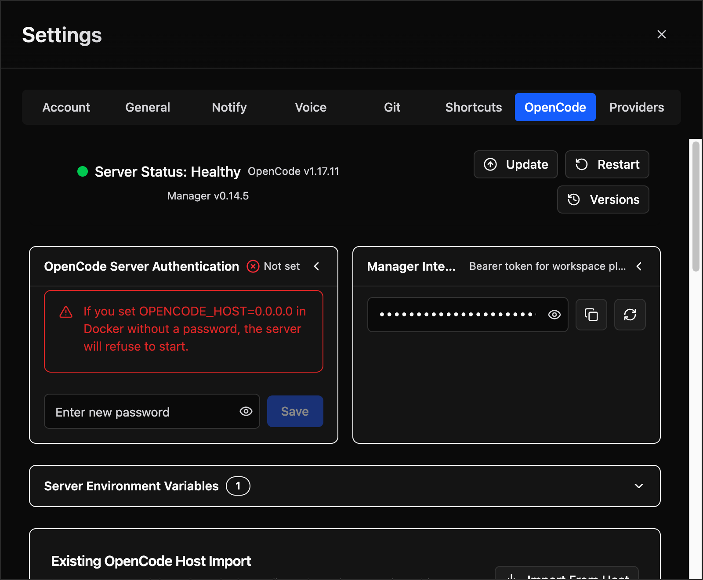

# OpenCode Server Health & Restart

Monitor the managed OpenCode server's status and control restarts and upgrades from the Settings UI.

## Overview

OpenCode Manager runs a supervised OpenCode server process to handle agent sessions. The **OpenCode** tab in Settings shows the server's current status, version information, and provides controls for restarting or upgrading the server without bringing down the Manager itself.

## Server Status

| Indicator | Meaning |
|-----------|---------|
| **Healthy** | The OpenCode server is running and responding to health checks |
| **Unhealthy** | The server is not responding. The Manager will attempt automatic recovery. |
| **Starting** | The server is being initialized after a restart or Manager startup |

The panel also displays:

- **OpenCode version** — The installed version of the OpenCode server (e.g., `v1.17.11`)
- **Manager version** — The current OpenCode Manager version (e.g., `v0.14.5`)

## Health Monitoring

The Manager periodically polls the OpenCode server's health endpoint. If the server becomes unresponsive:

1. The Manager logs the failure and increments a failure counter
2. After a configurable number of consecutive failures (default: 2), automatic recovery begins
3. Recovery restarts the OpenCode server process
4. In-flight sessions are aborted and resumed once the server is healthy again

### Configuration

Health monitoring is configured through environment variables:

| Variable | Default | Description |
|----------|---------|-------------|
| `OPENCODE_HEALTH_WATCH_ENABLED` | `true` | Enable health watcher and recovery (`false` in tests) |
| `OPENCODE_HEALTH_POLL_MS` | `30000` | Poll interval in milliseconds |
| `OPENCODE_HEALTH_FAILURE_THRESHOLD` | `2` | Failed checks before recovery starts |

## Configuration Recovery

The on-disk global configuration files in `.config/opencode/` are the source of truth. OpenCode merges up to three recognized sources in order — `config.json`, `opencode.json`, then `opencode.jsonc` — with later files overriding matching keys from earlier ones. The Manager reads and edits the same set: saves patch only the changed paths into the preferred existing source (`opencode.jsonc` > `opencode.json` > `config.json`), preserving comments and untouched keys, and a fresh installation is seeded with `opencode.jsonc`. When a source exists at boot but fails validation, the Manager logs a warning and starts with the files unchanged — an invalid config is never automatically replaced or rolled back during boot.

The health-watch ladder is the only automatic repair path. When the supervised OpenCode server fails repeated health checks, recovery runs these actions in order until the server is healthy:

1. **Restart** — restart the server process
2. **Debug capture** — capture a diagnostic snapshot, then restart
3. **Rollback to last known good** — archive the broken config and restore the last known good config
4. **Seed default config** — write the minimal seed config and restart

Because the ladder only runs after repeated failed health checks, a config file that fails validation but does not make the server unhealthy is left in place. Setting `OPENCODE_HEALTH_WATCH_ENABLED=false` disables the ladder entirely, leaving no automatic repair path.

The last known good config is a snapshot of every recognized source file (including which ones exist), captured before every write made through the Settings UI, the internal API, or a host config import, so any of those can be undone with `POST /api/settings/opencode-rollback` or by the ladder. Restoring a snapshot rewrites the sources it contains and removes recognized sources it does not. Archived broken configs and debug snapshots are kept under `.opencode/state/health-watch/` in the workspace, pruned to the newest 20 files.

Earlier releases stored named configuration profiles in the Manager database. On first start after upgrading, each profile is archived to `.config/opencode-configs-archive/<name>.json` in the workspace, the default profile is restored to `opencode.json` if that file does not exist yet, and the database table is dropped.

## Restart with Session Resume

When you restart the OpenCode server (manually or through an upgrade), active sessions are handled gracefully:

1. **Capture** — The Manager captures all active user sessions (excluding subagent and scheduled-run sessions)
2. **Abort** — Active sessions are aborted cleanly on the running server
3. **Restart** — The OpenCode server process is stopped and started fresh
4. **Resume** — Once healthy, a `continue` prompt is automatically sent to each previously active session

### Confirmation

If there are active sessions when you click **Restart**, a confirmation dialog shows how many sessions will be interrupted. You can proceed or cancel.

## Upgrading OpenCode

Click **Update** to check for and install the latest OpenCode version. The process:

1. Checks the currently installed version against the latest available release
2. Downloads and installs the update if available
3. Restarts the server using the same session-resume flow described above
4. The new version is displayed in the status panel after restart

If the upgrade fails but the server recovers to a usable state, a recovery notice is shown with the fallback version.

## Manual Restart Triggers

Besides the explicit **Restart** button, the server is automatically restarted when:

- **Assistant workspace is reloaded** — Via the `POST /assistant/reload` internal API endpoint
- **Config import completes** — Importing a standalone OpenCode config into the workspace
- **Version upgrade** — After installing a new OpenCode version

Saving the OpenCode configuration never restarts the server on its own. Any change to the merged configuration is written to disk and flagged as **restart required**; the server keeps running on the previous configuration until you restart it. Two exceptions do not set the flag: comment-only edits, and changes limited to the `mcp` section, which the Settings UI applies to the running server directly. Saving a provider credential, or completing a provider OAuth flow, restarts the server through the same session-resume flow so newly configured providers are discovered.

A save is rejected with `409` when the files changed since you loaded them (stale revision), or when it would remove a value that is defined only in a lower-priority source file — removing it from the preferred file would leave the inherited value in effect.
