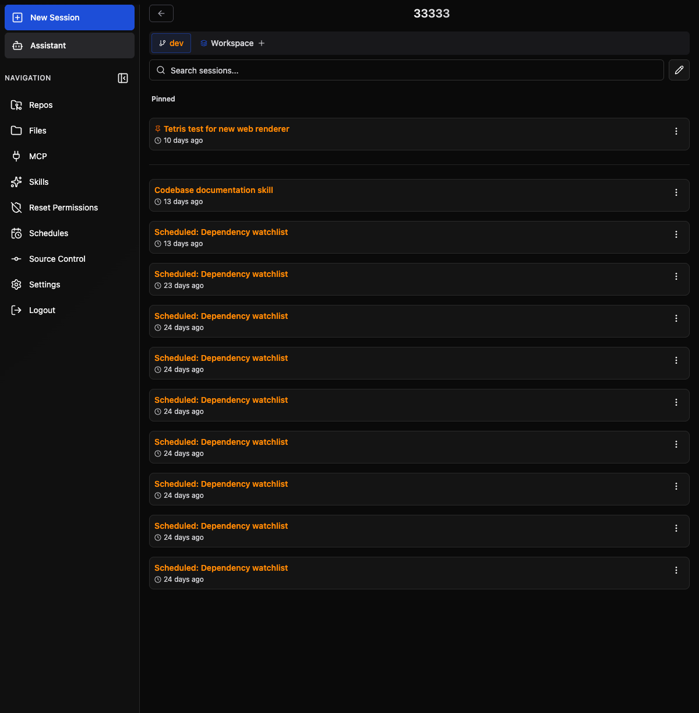
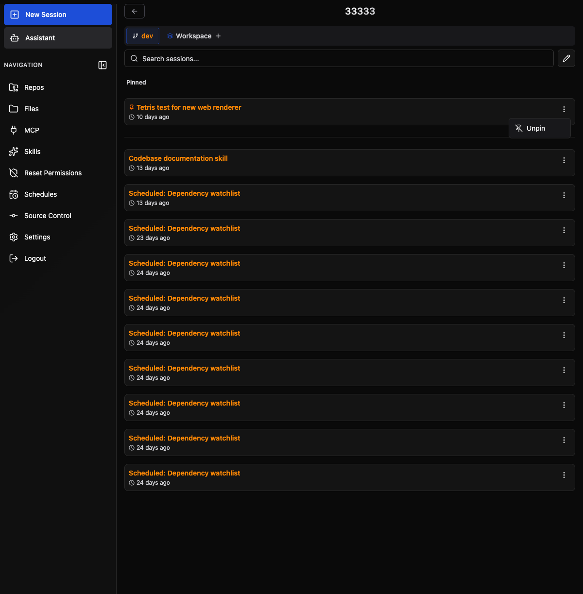

# Session Pinning

Pin important sessions to the top of your session list so you can find them quickly without searching.

## Overview

Session pinning lets you mark any session as "pinned" — it moves to a dedicated **Pinned** section above your **Recent** sessions, regardless of how old it is. This is useful for:

- Active feature branches you switch between throughout the day
- Long-running investigations or debugging sessions
- Sessions with important context you want to keep accessible

## Pinning a Session

Each session card has an actions menu (three dots or swipe gesture); the first entry toggles pinning:

The pinned session appears in a **Pinned** section above the **Recent** section. Unpinned sessions stay in **Recent** sorted by last activity.

Pin state persists across page reloads and browser sessions. Pinned sessions remain at the top until you unpin them.

## Managing Pins

| Action | How |
|--------|-----|
| **Pin a session** | Open the session actions menu and select **Pin to top** |
| **Unpin a session** | Open the session actions menu and select **Unpin** — it moves back to the Recent section |
| **Bulk operations** | Pin/unpin is per-session. Bulk delete and other management tools work as normal on pinned sessions |

## What Happens When a Pinned Session is Deleted

If a pinned session is deleted (manually or by context cleanup), it is removed from the Pinned section automatically. No stale pin entries remain.

## Notes

- Pinning is independent of session activity — a pinned session stays pinned even when new sessions push older ones out of the Recent view.
- The Pinned section supports any number of pinned sessions.
- Pinning is per-user and stored server-side, so it follows you across devices.
